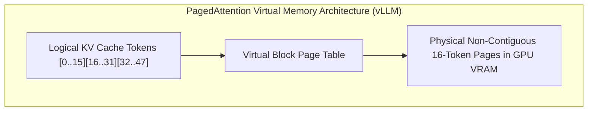

# Key-Value (KV) Cache & Memory Management (PagedAttention)

In autoregressive Transformers, calculating attention over previous tokens requires retaining Key and Value tensor states in GPU VRAM to avoid redundant quadratic matrix multiplications.

---

## 1. The KV Cache Memory Formula

$$\text{KV Cache Memory Per Token} = 2 \times n_{\text{layers}} \times n_{\text{heads}} \times d_{\text{head}} \times \text{precision\_bytes}$$

- **Worked Example: Llama-3-70B (Grouped-Query Attention GQA)**:
  - $n_{\text{layers}} = 80$
  - $n_{\text{kv\_heads}} = 8$ (GQA)
  - $d_{\text{head}} = 128$
  - Precision: FP16 ($2\text{ bytes}$)
  - **Memory Per Token**: $2 \times 80 \times 8 \times 128 \times 2 = \mathbf{327,680\text{ bytes}} \approx \mathbf{320\text{ KB/token}}$.
  - For a single request with $4,096\text{ context tokens}$:
    $$4096 \times 320\text{ KB} = \mathbf{1.31\text{ GB VRAM per request!}}$$

---

## 2. Memory Fragmentation & PagedAttention

Traditional inference engines allocated contiguous VRAM for the maximum possible context length (e.g. 8k tokens), leading to **$60\%-80\%$ wasted VRAM** due to internal and external memory fragmentation.

- **PagedAttention (vLLM)**: Treats GPU memory like OS virtual memory paging. Allocates KV cache in small, non-contiguous physical pages (16 or 32 tokens).
- Reduces memory waste from $70\%$ down to $< 4\%$, enabling a **$4\times$ increase in concurrent request batch size**.
