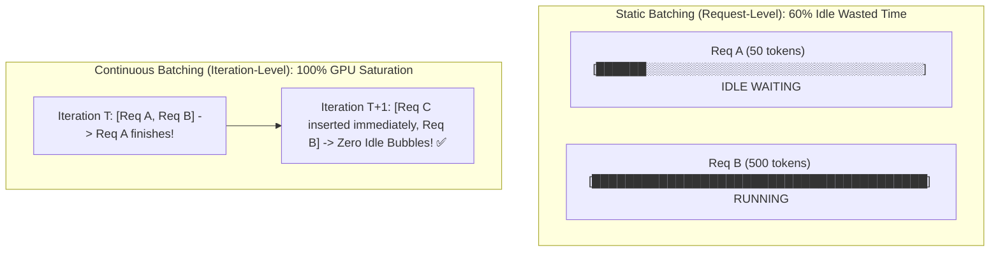

# Continuous Batching & High-Throughput Inference (vLLM)

Static batching in LLMs fails because request lengths vary wildly: a 10-token prompt batched with a 2,000-token prompt causes GPU cores to sit completely idle while waiting for the longest request to finish.

---

## 1. Static vs Continuous Batching

---

## 2. Iteration-Level Scheduling (Orca / vLLM)

- Rather than scheduling at the request level, the engine schedules at each individual token generation step (iteration).
- As soon as a request emits an `<EOS>` (End-of-Sequence) token, it is immediately evicted from the batch.
- A newly arrived prompt's Prefill phase is slotted into the very next iteration.
- Result: **$3\times - 5\times$ higher token throughput** per GPU.
