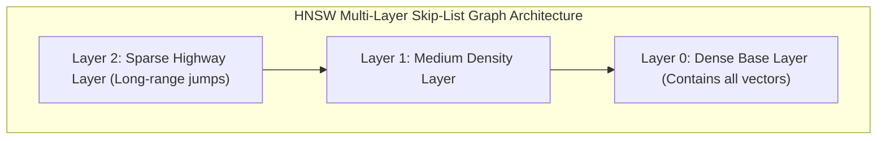

# Vector Search Indexes: HNSW & Embeddings

Vector search enables semantic similarity search across high-dimensional floating-point embeddings generated by machine learning models.

---

## 1. Hierarchical Navigable Small World (HNSW)

HNSW is the industry standard graph-based algorithm for Approximate Nearest Neighbor (ANN) search, providing $\mathcal{O}(\log N)$ search complexity.

- **Search Traversal**: Query starts at top sparse layer (Layer 2), greedily navigates to closest neighbor node, drops down to Layer 1, and repeats until reaching Layer 0.
- **Recall vs Latency**: Achieves $> 98\%$ recall with sub-10ms query latency across 100M+ vectors.

---

## 2. Distance Metrics

- **Cosine Similarity**: $\cos(\theta) = \frac{A \cdot B}{\|A\| \|B\|}$ (Normalized angle between vectors; standard for text embeddings).
- **Euclidean Distance ($L_2$)**: $\|A - B\| = \sqrt{\sum (A_i - B_i)^2}$ (Standard for image feature descriptors).
- **Dot Product**: $A \cdot B = \sum A_i B_i$ (Fastest when embeddings are pre-normalized to unit length).
