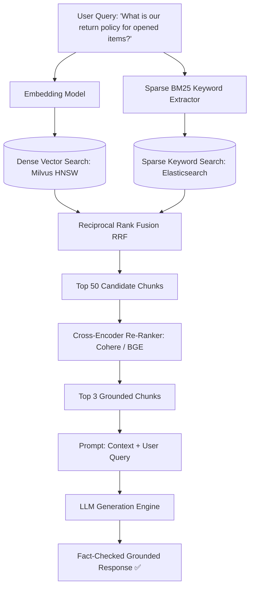

# Production RAG (Retrieval-Augmented Generation) Architecture

Retrieval-Augmented Generation dynamically grounds LLM responses in external authoritative enterprise documents, eliminating hallucinations and enabling private knowledge search.

---

## 1. Advanced Hybrid RAG Pipeline

---

## 2. The 4 Stages of Modern RAG
1. **Semantic Chunking**: Split documents by Markdown headers / sentences with $10\%$ overlap (e.g. 512-token chunks).
2. **Hybrid Search**: Combines Dense Vector ANN (captures semantic meaning) with Sparse BM25 (captures exact SKUs and part numbers).
3. **Cross-Encoder Re-Ranking**: Deep neural cross-attention scores top 50 candidates down to top 3 ultra-relevant snippets.
4. **Output Groundedness Validation**: Validates that every claim in the response is backed by retrieved citations.
