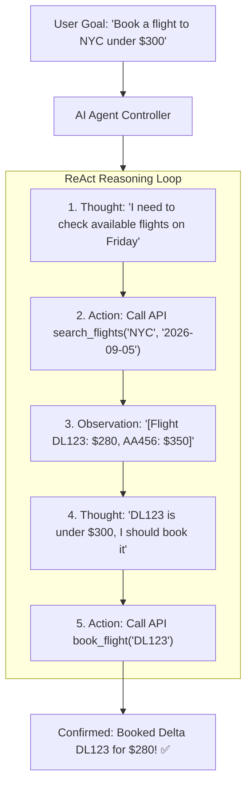

# AI Agent Architectures: Tool Use & Autonomous Reasoning

AI Agents extend pure LLMs from static text generators into autonomous systems capable of reasoning, planning, executing external APIs, and remembering past interactions.

---

## 1. The ReAct (Reason + Act) Loop

---

## 2. Core Agent Architectural Primitives
- **Planning & Decomposition**: Breaking large complex goals into ordered sub-tasks.
- **Tool Execution Sandbox**: Executing arbitrary API calls or Python code in ephemeral, isolated sandboxes.
- **Memory Systems**:
  - **Short-Term Working Memory**: In-context conversation history and intermediate tool outputs.
  - **Long-Term Episodic Memory**: Vector database indexing past user sessions and learned preferences.
- **Self-Correction & Reflection**: Validating tool execution outputs; automatically retrying with corrected parameters upon API error.
