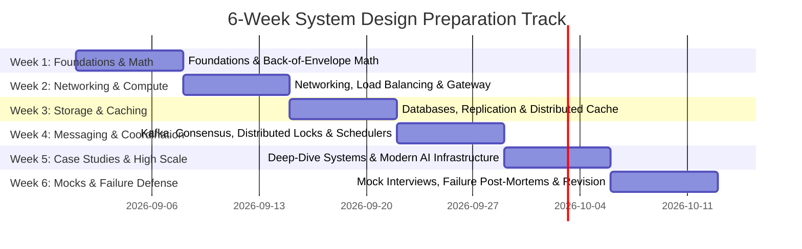

# 6-Week Structured System Design Study Roadmap

> **Target Audience**: SDE2, Senior Backend Engineer, Staff Engineer Candidates
> **Commitment**: 1.5 – 2.0 Hours / Day
> **Philosophy**: Understand → Visualize → Implement → Reuse → Apply → Explain → Defend Trade-offs

---

## 🗓️ Weekly Overview

---

## 📅 Daily Study Structure (Every Day)

For every single study day, execute these 6 disciplined steps:
1. 📖 **LEARN (25 mins)**: Deep dive into the theoretical concept in `01-introduction`, `03-distributed-systems`, or `04-non-functional-requirements`.
2. 👁️ **VISUALIZE (15 mins)**: Trace the Mermaid architecture and request/data flow diagrams.
3. 💻 **IMPLEMENT (30 mins)**: Review or write the runnable Java / Spring Boot reference code in `09-implementations`.
4. 🏗️ **DESIGN (30 mins)**: Apply the building block to a major system case study in `07-case-studies` using the **DESIGN-FLOW** framework.
5. 🎤 **INTERVIEW (15 mins)**: Practice verbalizing answers to the deep follow-up questions in `10-interview-practice`.
6. 📝 **REVISE (5 mins)**: Review the corresponding cheat sheet in `11-cheatsheets`.

---

## 🗓️ Week 1 — Foundations, Interview Strategy & Capacity Estimation

- **Day 1: What is System Design & Interview Architecture**
  - *Learn*: System Design vs LLD (`INT-01`, `INT-02`, `INT-03`).
  - *Visualize*: The 45-Minute DESIGN-FLOW framework (`FND-01`).
  - *Practice*: Scoping functional vs non-functional requirements (`FND-02`).
  - *Revise*: `11-cheatsheets/system-design-interview.md`.

- **Day 2: Distributed Systems Core & Partial Failure Models**
  - *Learn*: Network models, RPC vs REST, crash-stop vs Byzantine faults (`DST-01`, `DST-02`).
  - *Visualize*: Unreliable network delay vs packet loss sequence diagram.
  - *Practice*: Answering failure handling in interview rounds.

- **Day 3: Back-of-the-Envelope Math & Numbers to Know**
  - *Learn*: Powers of two, latency hierarchy numbers (`CAP-01`).
  - *Calculate*: Convert 100M DAU to read/write QPS and peak traffic (`CAP-02`).
  - *Revise*: `11-cheatsheets/capacity-estimation.md`.

- **Day 4: Storage & Bandwidth Sizing**
  - *Learn*: 5-year data retention, replication multipliers, metadata vs blob sizing (`CAP-03`, `CAP-04`).
  - *Calculate*: Sizing calculations for 10M daily photo uploads.

- **Day 5: Memory & Distributed Cache Capacity Math**
  - *Learn*: 80-20 Pareto principle for cache sizing, RAM vs SSD economics (`CAP-05`).
  - *Calculate*: Sizing a Redis cluster for 500M daily active URLs (`CS-09`).

- **Day 6: High-Level Architecture & Component Decomposition**
  - *Design*: First end-to-end architecture: URL Shortener (`CS-09`).
  - *Implement*: Java 21 Base62 encoder + Snowflake sequencer (`IMP-02`).

- **Day 7: Weekly Review & Capacity Estimation Drills**
  - *Drill*: 5 rapid capacity estimation problems from `10-interview-practice/capacity-estimation/`.

---

## 🗓️ Week 2 — Networking, Ingress, Load Balancing & Gateways

- **Day 8: DNS, Anycast & Geo-Routing**
  - *Learn*: Authoritative DNS, TTL caching, GeoDNS, Anycast BGP routing (`BB-01`).
  - *Visualize*: Global client to edge POP routing.

- **Day 9: Load Balancers (L4 vs L7)**
  - *Learn*: Layer 4 (TCP/UDP IP hash) vs Layer 7 (HTTP path/header) load balancing (`BB-02`).
  - *Visualize*: Reverse proxy connection pooling and health checks.
  - *Revise*: `11-cheatsheets/load-balancing.md`.

- **Day 10: API Gateway Architecture**
  - *Learn*: Authentication, SSL termination, dynamic routing, protocol translation (`BB-19`).
  - *Implement*: Spring Cloud Gateway / Netty non-blocking filter simulator (`IMP-09`).

- **Day 11: Distributed Rate Limiting**
  - *Learn*: Token Bucket, Leaky Bucket, Sliding Window Log vs Counter (`BB-13`).
  - *Implement*: Atomic Redis Lua script Sliding Window Counter in Java (`IMP-01`).

- **Day 12: Content Delivery Networks (CDNs)**
  - *Learn*: Push vs Pull CDN, edge token validation, static vs dynamic caching (`BB-05`).
  - *Design*: Video asset delivery tier for YouTube / Netflix (`CS-01`).

- **Day 13: Case Study — Distributed Web Crawler**
  - *Design*: Politeness queues, Bloom filters, DNS resolver caching, HTML deduplication (`CS-10`).

- **Day 14: Weekly Review & Failure Analysis**
  - *Failure Study*: Client Retry Storms & Avalanche Effects (`FL-02`).

---

## 🗓️ Week 3 — Databases, Caching & Partitioning

- **Day 15: Relational DBs, ACID & WAL Mechanics**
  - *Learn*: B-Tree indexing, Write-Ahead Logging (WAL), isolation levels (`BB-03`).
  - *Revise*: `11-cheatsheets/database-selection.md`.

- **Day 16: NoSQL & Distributed Key-Value Stores**
  - *Learn*: LSM-Trees, SSTables, MemTable, Bloom filters vs B-Trees (`BB-04`).
  - *Visualize*: Write amplification and compaction pipelines.

- **Day 17: Database Replication & Consistency Trade-offs**
  - *Learn*: Leader-Follower, Multi-Leader, Quorum $R + W > N$, Read-Your-Writes (`DST-04`, `DST-06`).
  - *Revise*: `11-cheatsheets/replication.md` & `11-cheatsheets/consistency.md`.

- **Day 18: Sharding & Consistent Hashing**
  - *Learn*: Range vs Hash sharding, virtual nodes on the hash ring, resharding (`DST-05`).
  - *Revise*: `11-cheatsheets/partitioning.md`.

- **Day 19: Distributed Caching Patterns**
  - *Learn*: Cache-Aside, Read-Through, Write-Through, Write-Behind, Cache Stampede (`BB-10`).
  - *Implement*: Multi-tier L1 (Caffeine) + L2 (Redis) Cache in Java (`IMP-03`).
  - *Revise*: `11-cheatsheets/caching.md`.

- **Day 20: Case Study — Yelp / Proximity Search Platform**
  - *Design*: Geohash vs Quadtree spatial indexing, caching hot points of interest (`CS-04`).

- **Day 21: Case Study — Instagram / Flickr Photo Sharing Platform**
  - *Design*: Photo metadata partitioning, S3 object storage chunking, CDN tier (`CS-08`).

---

## 🗓️ Week 4 — Messaging, Distributed Coordination & Reliability

- **Day 22: Distributed Queues vs Pub/Sub**
  - *Learn*: RabbitMQ (broker-centric push) vs Kafka (distributed commit log pull) (`BB-11`, `BB-12`).
  - *Revise*: `11-cheatsheets/messaging.md`.

- **Day 23: Deep Dive into Apache Kafka Architecture**
  - *Learn*: Partition topology, consumer group rebalancing, ISR (In-Sync Replicas), log compaction (`BB-12`).
  - *Implement*: High-throughput idempotent Kafka producer & consumer in Spring Boot (`IMP-04`).
  - *Revise*: `11-cheatsheets/kafka.md`.

- **Day 24: Distributed Locks & Leader Election**
  - *Learn*: Redlock, Zookeeper ephemeral nodes, fencing tokens (`BB-21`, `BB-31`).
  - *Implement*: Redis distributed lock with auto-renewing lease in Java (`IMP-05`).

- **Day 25: Distributed Task Schedulers & Priority Queues**
  - *Learn*: Delay queues, hierarchical time wheels, worker task stealing (`BB-17`, `BB-27`).
  - *Implement*: Distributed job scheduler in Java (`IMP-06`).

- **Day 26: Distributed Transactions & Financial Idempotency**
  - *Learn*: Two-Phase Commit (2PC) vs Saga pattern, double-entry bookkeeping (`BB-36`, `DST-10`).
  - *Implement*: Payment idempotency filter & atomic transaction engine (`IMP-08`).

- **Day 27: Case Study — Stripe / Payment Gateway & Ledger**
  - *Design*: Bank integrations, idempotency keys, webhook retry engines, ledger immutability (`CS-15`).

- **Day 28: Weekly Review & Failure Analysis**
  - *Failure Study*: Thundering Herd & Cache Stampede (`FL-03`) + Cascading Failures (`FL-01`).

---

## 🗓️ Week 5 — High-Scale Platforms & Modern AI Infrastructure

- **Day 29: Social Networks & Newsfeeds (Twitter / X)**
  - *Design*: Fan-out on write vs Fan-out on read, timeline caching, celebrity hot keys (`CS-06`, `CS-07`).
  - *Building Blocks*: Timeline generator (`BB-33`), Sharded counter (`BB-18`).

- **Day 30: Real-Time Messaging Platforms (WhatsApp / Discord)**
  - *Design*: Persistent WebSocket connections, presence clusters, end-to-end encryption (`CS-11`).
  - *Building Blocks*: WebSocket Gateway (`BB-37`), Notification Service (`BB-23`, `IMP-07`).

- **Day 31: Uber / Ridesharing & Real-Time Geospatial Matching**
  - *Design*: Driver location ingestion, Google S2 cells, dynamic surge pricing (`CS-05`).

- **Day 32: Search Autocomplete & Typeahead System**
  - *Design*: Distributed Trie, frequency aggregation, top-k ranking, edge caching (`CS-12`).

- **Day 33: Collaborative Real-Time Editors (Google Docs)**
  - *Design*: Operational Transformation (OT) vs CRDTs, WebSocket broadcast (`CS-13`).

- **Day 34: Modern AI Systems — LLM Inference & Token Streaming**
  - *Learn*: Continuous batching, PagedAttention, KV cache sizing, SSE streaming (`AI-01`, `AI-02`, `AI-05`).
  - *Design*: ChatGPT-like conversational platform (`CS-17`).

- **Day 35: Modern AI Systems — RAG & Vector Search Pipelines**
  - *Learn*: Vector embedding pipelines, HNSW graphs, dense-sparse hybrid search (`AI-06`, `AI-07`, `BB-39`).
  - *Design*: Enterprise AI Coding Assistant (`CS-20`).

---

## 🗓️ Week 6 — Mock Interviews, Failure Defense & Final Review

- **Day 36: Full Mock Interview 1 — Video Streaming Platform (YouTube / Netflix)**
  - *Execute*: 45-minute timed interview simulation (`10-interview-practice/mock-interviews/`).

- **Day 37: Full Mock Interview 2 — Global Ride Hailing Service (Uber)**
  - *Execute*: 45-minute timed interview simulation.

- **Day 38: Full Mock Interview 3 — Payment & Ledger Infrastructure (Stripe)**
  - *Execute*: 45-minute timed interview simulation.

- **Day 39: Production Failure Drills & Incident Post-Mortems**
  - *Drill*: Split-brain (`FL-05`), Out-of-order events (`FL-10`), Clock drift (`FL-11`), Connection pool starvation (`FL-13`).

- **Day 40: Architectural Trade-off Defense Drills**
  - *Practice*: 15 rapid-fire trade-off questions from `10-interview-practice/trade-offs/`.

- **Day 41: Senior / Staff Level Nuances & Cost Optimization**
  - *Review*: Multi-region active-active deployment, S3 storage tiering, blast radius control.

- **Day 42: Final High-Density Cheat Sheet Revision**
  - *Review*: All 13 cheat sheets in `11-cheatsheets/` before your real interview rounds!
