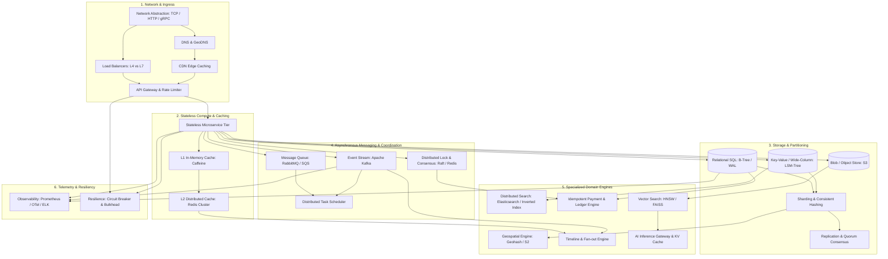
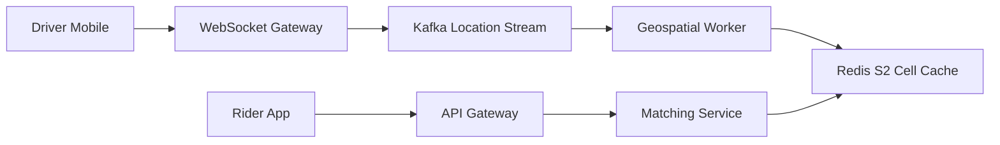
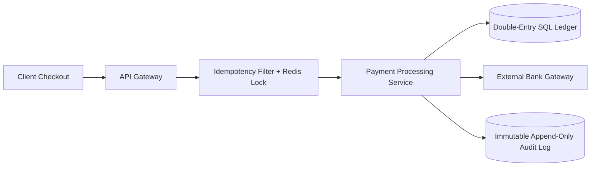
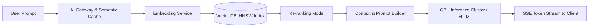

# System Design Architecture Dependency Graph

This dependency graph maps how foundational concepts, communication primitives, storage engines, distributed coordination primitives, and specialized domain engines interconnect to form large-scale enterprise architectures.

---

## 🗺️ Master Architecture Dependency Graph

---

## 🔍 Domain-Specific Subsystem Flows

### A. Real-Time Geospatial Platform (Uber / Yelp)

### B. High-Volume Financial Payment Platform (Stripe)

### C. Modern AI / LLM RAG & Inference Platform (ChatGPT / Cursor)

