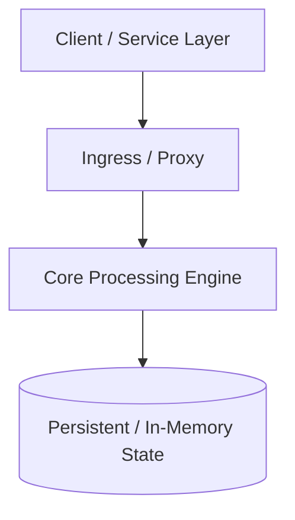

# Building Block: <Component Name>

> **Module**: `06-building-blocks`
> **Reusability Category**: Core Infrastructure / Storage / Communication / Reliability

---

## 1. Problem
What specific operational or architectural bottleneck does this building block solve?

## 2. Requirements
- **Functional**: Core capabilities expected by client services.
- **Non-Functional**: Latency bounds (p99), throughput capacity, availability targets (e.g. 99.999%), consistency models.

## 3. Why it exists
Why can't applications handle this capability locally or with a generic database?

## 4. Mental model
High-level conceptual analogy and core invariants.

## 5. Core concepts
Fundamental primitives, data structures, and algorithmic principles underpinning the component.

## 6. Architecture

## 7. Request/Data Flow
Step-by-step trace of standard Read, Write, and Failover workflows.

## 8. Data Model
Internal state representation, memory layouts, or on-disk schemas.

## 9. API Design
gRPC and REST interfaces, protocol definitions, payload schemas.

## 10. Algorithms
Core algorithms (e.g., Consistent Hashing, Sliding Window Logs, Gossip Protocol, Raft Consensus, Bloom Filters).

## 11. Scaling
Horizontal vs Vertical scaling, stateless compute tiers, partition management.

## 12. Partitioning
Sharding strategies, key selection, rebalancing, hotspot prevention.

## 13. Replication
Leader-Follower, Multi-Leader, Leaderless replication mechanics and quorum rules ($R + W > N$).

## 14. Consistency
CAP & PACELC positioning, linearizability, sequential consistency, eventual consistency, read-your-writes.

## 15. Failure Scenarios
Crash-stop, crash-recovery, network partitions, split-brain, corrupted state.

## 16. Recovery
Failover protocol, leader election, snapshot restoration, replay logs.

## 17. Observability
Key SLIs/SLOs, critical metrics (RED/USE), distributed tracing tags, structured logging.

## 18. Security
Authentication, TLS termination, RBAC, data encryption at rest and in transit.

## 19. Performance
Cache locality, zero-copy I/O, SIMD operations, memory-mapped files (mmap), connection pooling.

## 20. Trade-offs
Latency vs Durability, Throughput vs Consistency, Operational Complexity vs Cost.

## 21. When to Use
Ideal use-cases, workload profiles, and architectural sweet spots.

## 22. When NOT to Use
Anti-patterns, scenarios where simpler primitives suffice (e.g. Postgres vs dedicated KV store).

## 23. Implementation Strategy
How to build a production-grade version in Java / Spring Boot.

## 24. Practical Exercise
Step-by-step implementation drill or simulation for the learner.

## 25. Interview Questions
Top 5 deep-dive technical follow-ups asked by senior/staff interviewers.

## 26. Common Mistakes
Pitfalls candidates make during whiteboard and architecture rounds.

## 27. Quick Revision
Bullet-point cheat sheet for 5-minute pre-interview review.

## 28. Related Building Blocks
Links to dependent and complementary building blocks.

## 29. Related Case Studies
Links to end-to-end system architectures employing this block.
