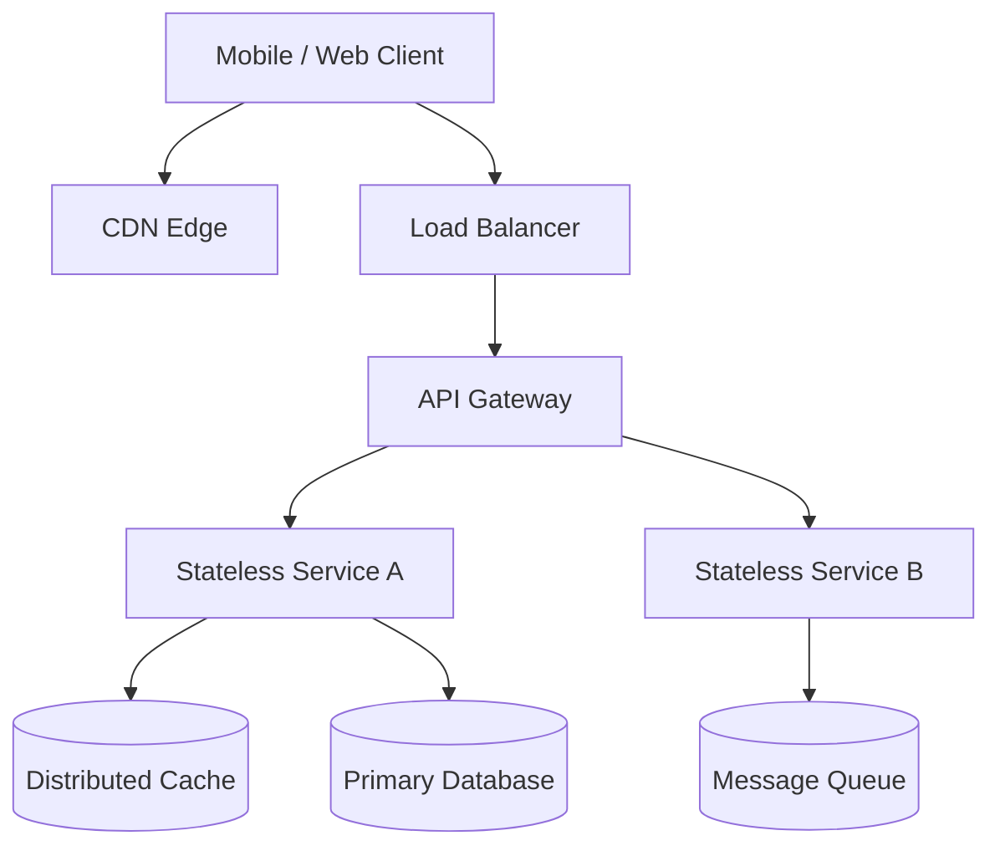

# System Design: <System Name>

> **Domain**: Media Streaming / E-Commerce / Social Network / Transportation / Financial
> **Interview Target**: SDE2 / Senior Backend / Staff Engineer

---

## 1. Problem
High-level problem overview, core business motivation, and operational context.

## 2. Requirements Clarification
Scoping questions to ask the interviewer to eliminate ambiguity and set boundaries.

## 3. Functional Requirements
- **FR-1**: Primary user action 1
- **FR-2**: Primary user action 2
- **FR-3**: Core asynchronous workflow

## 4. Non-Functional Requirements
- **NFR-1 (Availability)**: 99.99% availability (less than 52.6 minutes downtime/year).
- **NFR-2 (Latency)**: Read p99 < 50ms, Write p99 < 200ms.
- **NFR-3 (Scalability)**: Support $100	ext{M}$ DAU and $10	imes$ traffic spikes.
- **NFR-4 (Consistency)**: Eventual consistency for feeds; strong consistency for payments/state.

## 5. Assumptions
Quantified user base, regional distribution, device profiles, payload sizes.

## 6. Capacity Estimation
- **Traffic**: Daily Active Users (DAU), Read QPS, Write QPS, Peak multipliers ($3	imes$).
- **Storage**: Daily new data ingestion, 5-year retention trajectory, index overhead ($20\%$).
- **Bandwidth**: Ingress (MB/s), Egress (GB/s).
- **Memory & Cache**: Cache sizing (80-20 Pareto rule), 20% daily read volume in RAM.
- **Compute/Servers**: CPU cores, IOPS requirements, server cluster size.

## 7. API Design
Production REST / gRPC contract specifications:
- `POST /api/v1/...`
- `GET /api/v1/...`

## 8. Data Model
Relational vs NoSQL schema, primary keys, sharding keys, indexing strategies:
- Entities, relationships, access patterns, write amplification analysis.

## 9. High-Level Architecture

## 10. Detailed Architecture
Deep component breakdown: ingestion pipelines, workers, metadata catalogs, blob stores.

## 11. Request Flow
End-to-end trace of primary read and write operations.

## 12. Data Flow
Asynchronous event streaming, CDC (Change Data Capture), background reconciliation.

## 13. Database Selection
Justification of SQL vs Document vs Wide-Column vs Key-Value vs Graph vs Time-Series.

## 14. Caching
Multi-tier caching (Client, CDN, Gateway, Application, Redis), eviction policies (LRU/LFU), invalidation strategies (Cache-Aside, Write-Through).

## 15. Messaging
Kafka partition topology, consumer groups, message schemas (Protobuf/Avro), delivery semantics (at-least-once with idempotency).

## 16. Partitioning
Horizontal sharding strategies, consistent hashing rings, hot partition mitigations.

## 17. Replication
Cross-region active-active vs active-passive, replication lag mitigation, read replicas.

## 18. Consistency
CAP/PACELC trade-offs, transactional isolation levels, distributed transactions (Saga / 2PC).

## 19. Failure Handling
Circuit breakers, exponential backoff with jitter, dead-letter queues, graceful degradation.

## 20. Bottlenecks
Single points of failure (SPOF), resource saturation points, noisy neighbor mitigations.

## 21. Scaling Strategy
Auto-scaling policies, database connection pooling, read/write splitting, bulkheading.

## 22. Observability
Metrics (Prometheus/Grafana), Distributed Tracing (OpenTelemetry), Structured Logging (ELK).

## 23. Security
OAuth2/JWT authentication, rate limiting, DDoS shielding, mTLS between internal microservices.

## 24. Cost Considerations
Storage tiering (Hot, Warm, Cold S3), egress bandwidth optimization, server consolidation.

## 25. Trade-offs
Explicit technical trade-offs defended during the interview.

## 26. Alternative Designs
Alternative architectural choices and why they were rejected.

## 27. Final Architecture
Complete, end-to-end architecture diagram unifying all components.

## 28. Interview Follow-up Questions
5 deep technical follow-ups commonly probed by Staff/Principal interviewers.

## 29. Building Blocks Used
Cross-references to the reusable modules in `06-building-blocks/`.
