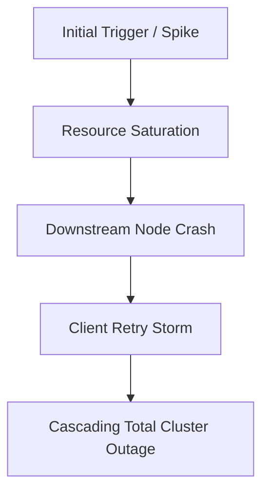

# System Failure Analysis: <Failure Scenario Name>

> **Category**: Cascading Failure / Concurrency Bug / Partitioning Defect / Storage Saturation
> **Severity**: Critical / P0 Outage

---

## 1. Failure Overview
Summary of the failure mode, historical real-world context, and architectural risk.

## 2. Root Cause Mechanics
Underlying physical, network, or algorithmic trigger.

## 3. Real-World Symptoms
- Spike in 5xx errors and latency degradation.
- CPU/Memory/Thread pool saturation across healthy instances.
- Database connection pool exhaustion and queue backlogs.

## 4. Detection & Telemetry
- Key metrics to monitor (Prometheus queries, saturation alerts).
- Log anomalies and trace signatures.

## 5. Immediate Mitigation (Emergency Runbook)
Actions on-call engineers take during an active incident to restore service.

## 6. Long-Term Recovery & Repair
Data reconciliation, state reconstruction, traffic draining.

## 7. Architectural Prevention
- Design patterns to eliminate this failure class (e.g., token bucket rate limiters, circuit breakers, jittered backoff).
- Automated chaos engineering tests.

## 8. Interview Defense Strategy
How to proactively identify and defend against this failure mode when designing systems.
